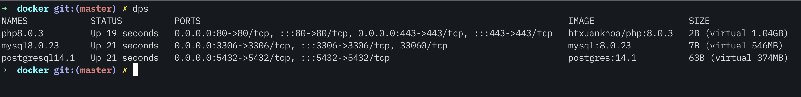

# Overview

On my local machine, I store all of my projects follow this convention.
This convention help me locate all of my projects easier.

```
~/dev
├── project1
└── project2
└── ...
└── projectN
```

Then, below is the screenshot when I'm using Docker environment



# Installation

Firstly, please copy the `.env.example` file

```bash
$ cp .env.example .env
```

Then, please **remember** to modify variables in the `.env` file before build containers.

```bash
# create log file on HOST machine to sync with Apache2's log file inside the CONTAINER
$ touch sync/logs/apache2_error.log

# build images & containers
$ docker-compose up -d web mysql postgresql
```

Please note that because the `~/dev` is my root folder of all projects so the `APPLICATIONS` variable I set to `~/dev`.
Please modify according to your environment.

# Useful commands

```bash
# Delete containers & images
$ docker stop <container-name>
$ docker rm <container-name>
$ docker images
$ docker rmi <image-id>

# Re-build only a specific service
#    --no-deps: don't start linked services.
#    --build: build images before starting containers.
$ docker-compose up -d --build --force-recreate --no-deps <service_name>

# SSH to the workspace container to perform commands
$ docker exec -it web /bin/bash

# Restore the dumped database to the MySQL container from HOST machine
$ docker exec -i db mysql -uroot -psecret <db_name> < path/to/db_dumped.sql

# clean up the components if needed
$ docker container prune
$ docker image prune
$ docker network prune
$ docker volume prune

# resolve the port was allocated error
# Example error message: "Bind for 0.0.0.0:443 failed: port is already allocated"
$ docker-compose down
$ sudo lsof -i -P -n | grep 443
$ kill -9 <process id>
$ docker-compose up

# find php.ini path
$ php -info | grep 'php.ini'

# Inspect network
$ docker network ls
$ docker network inspect <network_name>
```

**References**

- Timezone: UTC, Asia/Ho_Chi_Minh ( https://www.php.net/manual/en/timezones.php )

# License

[MIT license](https://opensource.org/licenses/MIT)
